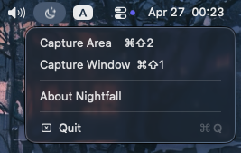
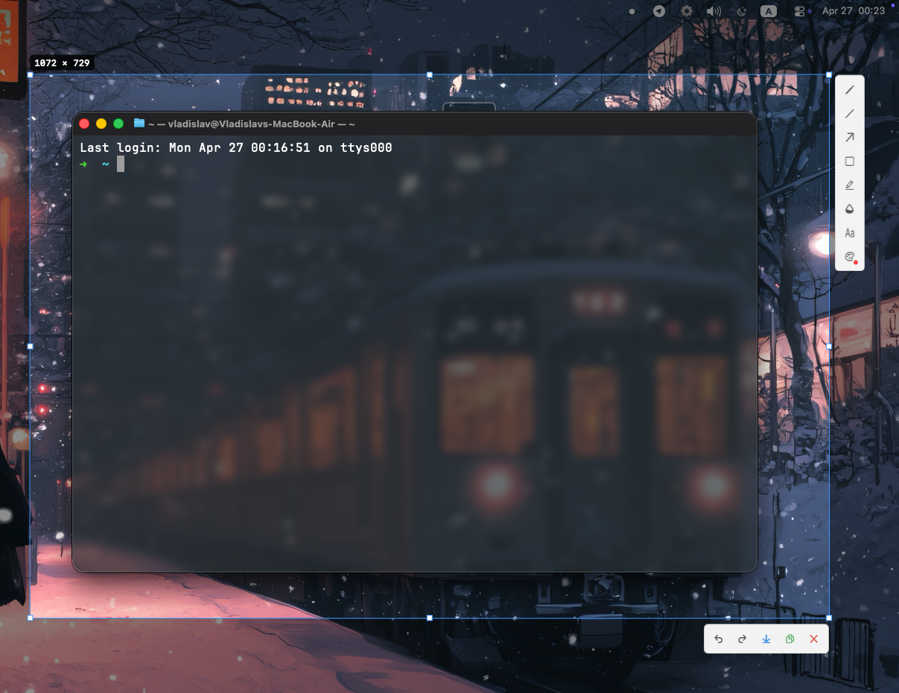

# Nightfall

## Description
**A native macOS menu bar screenshot and annotation tool inspired by Lightshot.** <br>
**The app lives in the menu bar with no Dock icon and provides the following:**
- **Capture screen area**
- **Capture specific app window**
- **Annotate with pencil, line, arrow, rectangle, marker, blur, text**
- **Save as PNG or copy to clipboard**
- **Undo / Redo**

### Screenshots:

### Tray



### Capture



## Requirements

- **macOS 13+**

## Setup

**1. Open Nightfall.dmg and drag it to Applications** <br>

**2. Launch the application:** <br>
`open Nightfall.app` or via `Finder`

On first launch macOS will ask for **Screen Recording** permission. <br>
Go to **System Settings → Privacy & Security → Screen Recording → enable Nightfall**.

**3. Place your icon (optional):** <br>
`Assets/icon.png` — 256×256 PNG, the build script scales it to all required sizes automatically.

## Hotkeys

| Key | Action |
|-----|--------|
| `⌘⇧2` | Capture area |
| `⌘⇧1` | Capture window |
| `Esc` | Cancel |
| `Enter` | Save |
| `⌘C` | Copy to clipboard |
| `⌘S` | Save to file |
| `⌘Z` / `⌘⇧Z` | Undo / Redo |

## Auto-start at login

**System Settings → General → Login Items → add `Nightfall.app`**

## Build from source

```bash
# default certificate name is NightfallDev
./build.sh

# build with a custom certificate
./build.sh --cert "Certificate Name"

# build and package into dmg
./build.sh --cert "Certificate Name" --package
```

The script compiles the app, generates the icon from `Assets/icon.png`, creates `Nightfall.app` and optionally packages it into `Nightfall.dmg`.
